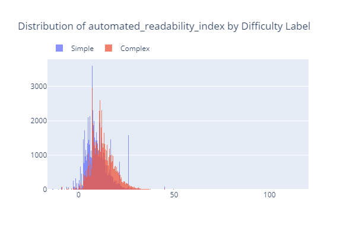
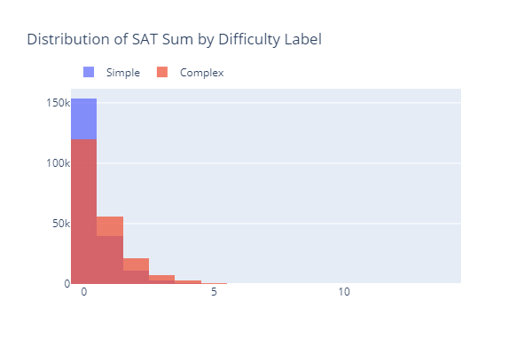
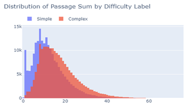
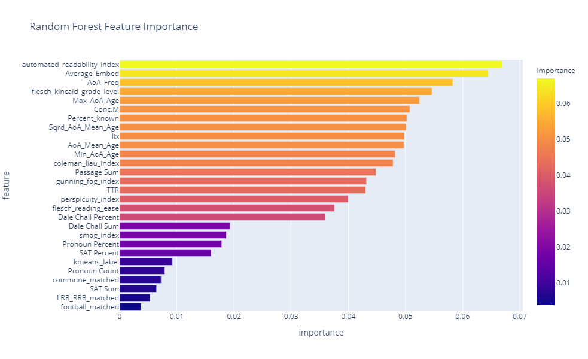
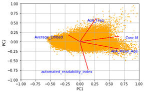
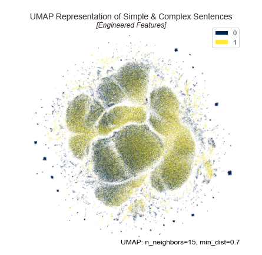
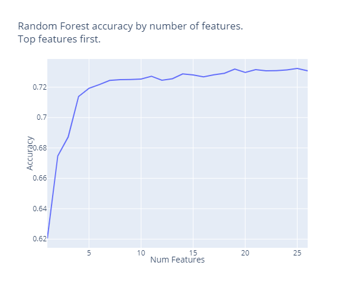

# Predicting Text Difficulty
SIADS 695 Milestone II Project 
by James Mete & Matt Dannheisser

This work aims to classify the textual complexity of sentences from the Simple English Wikipedia edition. We built a machine learning pipeline that used an evolving set of supervised models aided by processes of feature engineering and unsupervised learning to classify sentences into whether or not they require simplification. Such a task is useful in domains such as Simple Wikipedia that aims to present simplified articles that are easier to understand, especially for those who  have a limited abilities in comprehension of the English language.

We utilized the [Predicting Text Difficulty](https://www.kaggle.com/c/umich-siads-695-predicting-text-difficulty) challenge on Kaggle as a framework for structuring our process and setting goals of our research. Our primary goal is to reach a 0.8 accuracy score proven possible by previous iterations submissions.

Our key findings were the following:
<ol>
<li>Visual exploration of data revealed that the training data labels are perfectly balanced.</li>

<li>PCA transformation revealed the training data can be generally separated into simple and complex sentences, but heavy overlap in clusters exists.</li>

<li>Topic modeling revealed similar topics throughout the data, regardless of complexity label. Topics alone were not a significant indicator of text difficulty.</li>

<li>Clustering analysis revealed that a 2-cluster KMeans model performed best which correlates to our goal of binary classification. Our KMeans labels were 61% accurate compared to the training labels which suggests that our model is picking up on a true signal considering the dataset is balanced.</li>

<li>We trained multiple machine learning models, and observed best performance from BERT fine-tunedon our training data & engineered features which achieved an accuracy score of 77.6% on the test dataset provided by Kaggle.</li>

<li>Deep learning models were quick to over fit and sensitive to hyper parameter tuning.
</ol>

#### Data Exploration

Our major dataset were the files presented by the Kaggle challenge, but we added additional sources to help our feature engineering efforts. The data sources mentioned were used for both the unsupervised and supervised sections
of the project. Specifically, the files we used were:

**WikiLarge_Train.csv** [Kaggle]: 
Training dataset containing 416,768 sentences from Wikipedia that also contains labels. 0 refers to sentences that are
sufficiently simple, and1 refers to sentences that require review for simplification. Our exploration of the training
data revealed that the data is balanced in terms of labels. This makes classification accuracy more reasonable, but we decided to use both accuracy and F1 scores into consideration for extra information in model evaluation. 
**WikiLarge_Test.csv** [Kaggle]: 
Test dataset with 119,092 sentences without labels. Predicting the labels of this dataset is the main evaluation task based on the Kaggle challenge. The evaluation metric used is classification accuracy. 
**Dale_chall.txt** [Kaggle]: 
List of 3,000 words that are understood in reading by at least 80% of 5th graders. A sentence primarily composed of
these words is most likely to be a simple sentence. 
**SAT_words.csv** [External]: 
This file is an external CSV resource we collected to complement the existing files. This file contains 6,000 SAT
words which are considered more difficult. Our intuition was that words with more SAT words would be more likely
to be considered complex and thus require simplification.
**AoA_51715_words.csv** [Kaggle]:
This file contains Age of Acquisition (AoA) estimates for about 51k lemmatized English words with corresponding
metrics about the average age the lexical meaning is acquired. We selected the age of acquisition (AoA) of the
lemmatized word and the frequency of use in general English as features. The former represents the average
perceived difficulty of understanding the word and the latter represents the obscurity of the word through lack of
use. We were selective of which features to train the model on as we were attempting to avoid adding too much
noise. 
**Concreteness_ratings_Brysbaert_et_al_BRM.txt** [Kaggle]: 
This file contains "concreteness ratings" for 40 thousand English lemmatized words known by at least 85% of raters.
We selected the mean concreteness rating to demonstrate the ambiguity associated with these known words. The
concreteness word list was a narrower and better-known list of words compared to the Age of Acquisition list. The
concreteness score thus was focused on different types of ambiguity which added quality to our features.

#### Feature Engineering

Our text data is not enough to generate highly robust classifiers. Furthermore, our supervised methods revealed heavy overlap in terms of clusters and topics which increased the need for more robust features to help separate the simple from the complex sentences. Thus, we engineered 30 features using a machine learning cycle framework. We would explore the data, develop the models, and then repeat the cycle exploring and adding new features.

We also utilized external NLP metrics from the following sources: 
- **Text_ stats from Textacy** - Automated Readability Index, Coleman Liau Index,
Flesch Reading Index, Gunning Fog Index, Perspicuity Index, and Smog Index
* **Word Embeddings from FastText** - Average Word Embed and Sentence Embed
* **NLTK** - pronoun count and percentages

###### Methedology of Feature Selection:
The best features would ideally have less overlap in their distributions by label. We observed that the automated readability index and the AoA frequencies have quite stable but noticeable differences between the labels despite heavy overlap. On the other hand, features like SAT Sum had extreme overlap and were highly skewed towards lower values regardless of label.

 

We were able to deduce which of the features were acting as a word complexity scorer. Take the Passage Sum feature where the lower values are more likely to be simple sentences and the higher values are more likely to be complex sentences, as demonstrated by the blue bars and orange bars. This seems to suggest that a change in the complexity occurs when sentences have more than 16-18 words. This same trend occurs in the various AoA Age features and the Automated Readability Index.

Furthermore, we used the feature importance values generated by fitting our Random Forest models to check for the most useful features. We can see that certain features contribute a lot more to the classification process than others. In essence, this helped confirm our histogram analysis with the readability scores having relatively high feature importance and others such as SAT Sum having lower values. Feature importance analysis also helped us understand the task more intuitively. For example, we noticed higher importance for Max AoA age rather than the min or average. This makes sense in practice because a single pivotal but complex word in a sentence can be very difficult to understand and can often benefit from simplification.

Overall, our feature engineering and importance analysis revealed that there are multiple successful approaches to understanding complexity with the three main categories being:
<ol>
<li>Readability Scores: More complex formulas to quantify complexity based on research. These are more nuanced statistical methods that can give a more holistic view of the text difficulty. Full details of readability scores can be found in the Textacy documentation.</li>
<li>Standard & Historical Methods: This includes counting words or features in a more basic manner and/or matching them with existing resources of known complexity such as Dale Chall, SAT Words, or AoA.</li>
<li>Embedding Vectors: Our research highlighted the power of semi-supervised methods such as Sentence2Vec to generate a contextual vector in high dimensional space. Interestingly enough, even a single average value of the embedding was highly influential. While the full 50-dimensional vector did increase our accuracy by 1% in our Random Forest evaluation, the resource costs of doing so are high and most likely not worth it in practice. However, future research is warranted to further test the effect of higher dimensional embeddings on complexity classification.</li>
</ol>

#### Unsupervised Learning
Our main goal for the unsupervised portion of our project was to aid in improving our classification accuracy of the downstream application which involves supervised learning models. 

This could be a direct benefit such as producing effective cluster features that could be used as extra features, as well as indirect benefits such as interesting visualizations or data representations such as PCA and Topic Models that would reveal insights about the data that could inspire pipeline choices or new features to be created.

###### Dimensionality Reduction & Data Visualization
Visualizing our data using unsupervised methods was a key part of our project. We projected the data with a focus on our engineered features into different feature spaces using both PCA and UMAP, both of which are relatively efficient and able to handle large datasets.

We projected the data into PCA space first using the first two principal components to focus on the highest variance as well as make it easier to plot and visualize. PCA revealed an interesting structure of the data with a noticeable shift from left to right between our labels based on the training data. While there is heavy overlap in the labels, it gave us confidence that our features were producing noticeable differences between the labels. 

We also used a PCA representation to plot our feature vectors against the two major principal components. This helped us better understand our features in relation to each other and helped us check if any features were redundant. 

PCA represented data also gave us performance benefits in terms of speed due to reduced dimensions, but the effect on downstream accuracy varied. PCA worked fine with KMeans, but our machine learning models lost accuracy under using PCA representations. For example, our Random Forest went from 75% accuracy to 68% accuracy under PCA.

For UMAP, we also observed an interesting phenomenon where it segregated the data using our features into multiple clusters. However, the clusters UMAP found did not correlate with either label. In fact, most clusters were split equally between both labels. This may suggest that UMAP is finding other common themes. However, it is likely that UMAP is finding local clustering elements and not necessarily interesting global structure. Furthermore, the UMAP representation is highly dependent on parameters such as neighbors and minimum distance. We looped through different parameter options to check for interesting trends, but the sensitivity can be an issue. It is better than T-SNE but still vulnerable. Overall, the UMAP representation was visually interesting but less practically useful.

#### Supervised Learning
Supervised learning was a major part of our project with our main goal of achieving a high classification accuracy directly linked to our supervised learning models. We tested multiple different models utilizing our features and performing both manual testing of models using sci-kit learn as well as an automated model evaluation using PyCaret. For reproducibility reasons, we set the same seed values throughout as much as possible to limit fluctuations due to randomization. This aided us in comparing models while tuning hyper-parameters.

**Dummy Classifier:**

We started with a dummy classifier to set a “random” baseline. In our results, the accuracy was 50%. This is expected due to the balanced nature of the dataset.

**SVM Classifier:**

SVM classifiers performed decently but accuracy remained around 57%-65% depending on parameters and sample data. The rbf kernel performed the best during our testing, but within a single percentage point of the others overall. SVM faced severe challenges in scaling to the large dataset required and is not practical due to time constraints.

**Logistic Regression Classifier:**

Logistic regression had the advantage of being fast, being able to perform a 10-fold cross validation cycle on our training data of engineered features within 20 seconds. However, our accuracy remained at 66%-67% overall for the mean cross validation score. 

**Random Forest Classifier:**

The Random Forest performed well, achieving the best score out of any traditional machine learning models. We achieved a 75% cross-validation score on the training data using our regular features, and 76% if we used a full 50-dimensional sentence vector instead of a single average embedding value as features. However, the computational cost of doing so was high both in terms of memory and time.

The only metric where the Random Forest did not perform the best was in recall but it remained competitive. It should be noted that the models performing better in recall were worse overall and suffered in precision. Thus, the Random Forest was able to balance the precision-recall tradeoff which can also be seen by its leading F1 score.

Random Forests are an ensemble model that are a staple of traditional machine learning. They are robust to different features, and often perform very well with little tuning required. Furthermore, they are fast, easy to interpret  and explain due to the binary checkpoint nature of their structure acting like a complex flow-chart. Interpretability and overall performance are the major
 advantages of Random Forests which aids in both deployment, explaining results to stakeholders, and understanding the model to aid in feature engineering and parameter tuning. We used the feature importance values to aid our feature engineering efforts.

Furthermore, feature importance can be used to see the practical contribution of our features to our actual accuracy score. To do so, we retrained our Random Forest model with fixed parameters, but added in one extra feature per iteration starting from the most important features to the least and plotted the resulting accuracy of the model. We observed that our top features contributed heavily to the accuracy score, with performance hitting a slight plateau between 8-10 top features. This shows us that good feature engineering is vital to good performance.

##### Neural Networks
We were specifically interested in the potential of the deep learning models, but they are computationally expensive.. In order to get around the resource limitations, we used a pre-trained BERT transformer model that we fine-tuned on our training data. A semi-supervised pre-trained BERT model has a lot of potential and uses all aspects of machine learning. We used libraries such as Fastai and HuggingFace as they provide useful wrapper functions and pre-trained models. We saved all checkpoints and final models for efficiency purposes.

The MLP performed the worst at around 68% but could probably achieve better with more parameter tuning or architecture changes. The language models could easily achieve 75% accuracy with relatively little training or tuning. We developed our own wrapper functions to speed up our process of iteration to download different pre-trained models, tokenize our data, train the model, and then evaluate it on a specified percentage of data as a validation set. We used a test-set percentage of 5% - 10% in our testing.  In terms of evaluation metrics, we tracked training loss, validation loss, accuracy, and F1 score.

Hyper-parameter tuning was essential to good performance. We limited the maximum sequence length from 512 as default to 64. This helped improve memory and time efficiency, and restricted the information the model could learn which helped prevent overfitting which greatly boosted our accuracy score. We also modified learning rates and found that 3e-5 worked the best. We increased weight decay values from 0.01 to 0.1 to help prevent overfitting by regularizing the model more. 

To help improve accuracy, we concatenated our engineered numerical features to the end of the text passages joined by [SEP] tokens. We rounded off any numerical features to make them less unique since they would be used as tokens. This helped give extra data and information to the model.

All of these changes helped us boost our performance from around 73% to 77.2% accuracy / 0.79 F1 score during training. **Our best performing model was a deep learning model (BERT) fine-tuned on our training data & engineered features which achieved an accuracy score of 77.6% (0.77635) on the test dataset.**

It should be noted that the random forest model provided strong results with 76%, but the down size of this model is it required all of the feature engineering that required man hours to generate. 

The deep learning models performed well with little pre-processing of data, but faced a downside in terms of extreme performance costs, including high memory, processor, and time requirements. We helped tackle these by making sure to fine-tune models, using higher batch sizes, and off-loading training to a GPU when possible. However, despite these changes, models still took multiple hours to train and inference was also slow. Unfortunately, we noticed a trend where the deep learning models would start to overfit the data. There is a rather consistent point where the model begins to overfit where the training loss drops from 0.40 to 0.32 but the validation loss then increases by a few points. Furthermore, the accuracy will begin to drop after that as well. This might be caused by our initialization steps, but it warrants further investigation. Better parameter tuning may solve this issue.

#### Conclusions and Next Steps
We believe our research has given us more insight into what it takes to identify a sentence that needs to be simplified. We ran a continuous cycle of data exploration, feature engineering, unsupervised learning, supervised learning, deep learning, and continually iterated to improve our accuracy step by step. We achieved a 77.6% accuracy score on the test data, but intend to research additional features as well as modify hyperparameters to improve results in order to reach the goal of 80% accuracy. 

We believe that more effective features would be beneficial. For example, one of our features was the Type-Token Ratio, but our extended research shows that there are alternatives such as Guiraud’s corrected TTR (GTTR) or  Caroll’s corrected TTR (CTTR) which show more importance in terms of complexity text classification. We would like to explore the Dynamic Support of Contextual Vocabulary Acquisition for Reading API that was recommended by Professor Kevyn Collins-Thompson to generate interesting readability scores.

Furthermore, we were very impressed by the relatively easy win of the deep learning model. It was able to exceed the traditional machine learning models on the text alone. We believe that with more resources and time to train bigger or more complex models such as GPT-3 variants that we could achieve even greater results. We also believe that further investigation and tuning of the deep learning models or preprocessing of the data is needed to help overcome the overfitting issue we encountered. 

#### Replication
We have provided three jupyter to reproduce our code corresponding to our major areas of feature engineering, unsupervised learning, and supervised learning
###### Requirements

###### Process

#### Statement of Work
We worked together on most areas of the project with multiple calls and collaboration sessions to code together. While we did have different focuses, it was a highly collaborative effort as we refined our total pipeline and research together. Our focuses included:
* James Mete: Unsupervised & Supervised Learning, Deep Learning, Visualizations, Feature Importance.
* Matt Dannheisser: Feature Engineering, Pipeline Construction, Refactoring of Code.

#### Work Cited
Dale E; Chall J (1948). "A Formula for Predicting Readability". Educational Research Bulletin. 27: 11–20+28. (n.d.).

Bansal, S., & Aggarwal, C. (2021, September 5). textstat 0.7.2. Retrieved from PyPi: pypi.org/project/textstat/
Brysbaert, M. W. (2021, September 22). 
Concreteness ratings for 40 thousand English lemmas. Retrieved from Crr.ugent.be: http://crr.ugent.be/papers/Concreteness_ratings_Brysbaert_et_al_BRM.xlsx

Transfer learning in text. fastai. (n.d.). Retrieved September 14, 2021, from https://docs.fast.ai/tutorial.text.html.

Kotani , K., Yoshimi , T., & Isahara, H. (n.d.). A Machine Learning Approach to Measurement of Text Readability for EFL Learners Using Various Linguistic Features . 26 September 2021; David Publishing. P 771.

Kuperman, V., & Stadthagen-Gonzalez, H. (2021, September 22). Age-of-acquisition (AoA) norms for over 50 thousand English words. Retrieved from Crr.urgent.be: http://crr.ugent.be/archives/806

Kurdi, M. Z. (2020, July 29). Text complexity classification based on linguistic information: Application to intelligent tutoring of ESL. arXiv.org. Retrieved September 26, 2021, from https://arxiv.org/abs/2001.01863.

Rockikz, A. (2020, December 25). How to fine tune bert for text classification using Transformers in python. Python Code. Retrieved September 15, 2021, from https://www.thepythoncode.com/article/finetuning-bert-using-huggingface-transformers-python.

Rosewood Media. (2021, August 10). SAT Vocabulary 1.0. Retrieved from Most Comprehensive SAT Word List on the Web.: https://satvocabulary.us/INDEX.ASP?CATEGORY=6000LIST

Simple English Wikipedia. (2009).
T. Mikolov, E. Grave, P. Bojanowski, C. Puhrsch, A. Joulin. Advances in Pre-Training Distributed Word Representations

